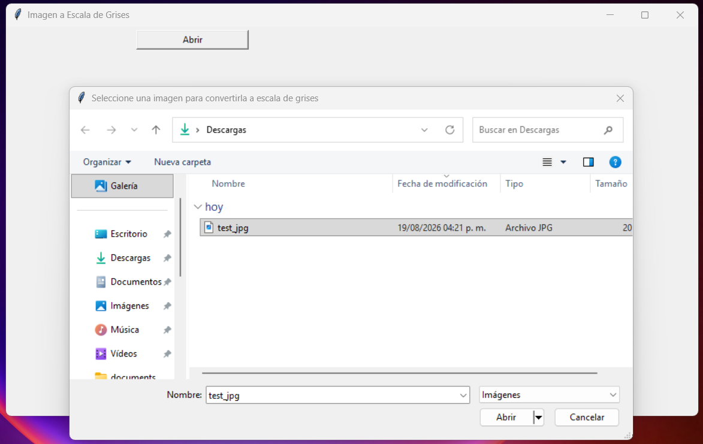
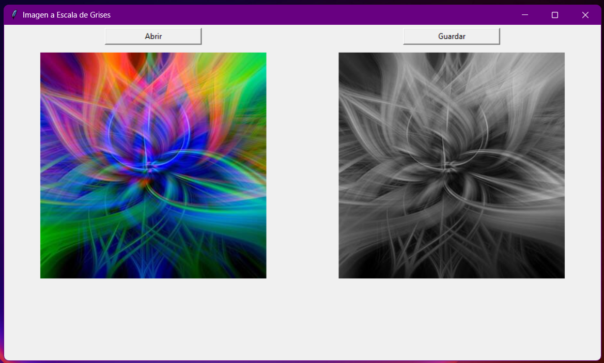
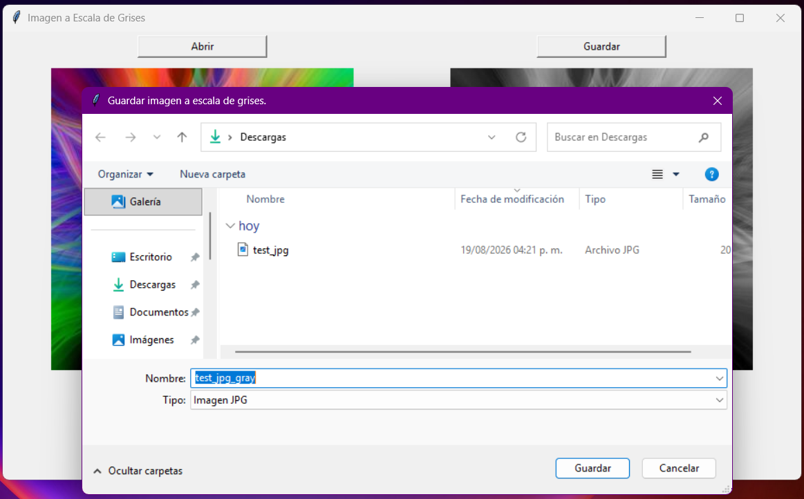

<div align="center">


<p style="font-size: 14px; font-weight: bold;"> Universidad Nacional Autónoma de México </p>
<p style="font-size: 14px; font-weight: bold;"> Escuela Nacional de Estudios Superiores Unidad Morelia </p>
<br>
<p style="font-size: 18px; font-weight: bold;"> Ejercicio GUI </p>
<br>
<p style="font-size: 12px;"> PRESENTA: </p>
<p style="font-size: 16px; font-weight: 500;"> Aguilar Uribe Alexis Uriel </p>
<p style="font-size: 14px;"> Numero de Cuenta:<br> 424060075 </p>
<br>
<br>
<p style="font-size: 12px;"> PROFESOR: </p>
<p style="font-size: 16px; font-weight: 500;"> Dr. Tinoco Martínez Sergio Rogelio </p>
<br>
<br>
<p style="font-size: 14px;"> Licenciatura  en Tecnologías para la Información en Ciencias </p>
<p style="font-size: 15px;"> Procesamiento Digital de Imágenes </p>
<br>
<p style="font-size: 14px;"> A 26 de Agosto de 2026 </p>
</div>

---

## Introducción
Una parte fundamental al momento de realizar Procesamiento Digital de Imágenes (PDI) es visualizar el resultante de las transformaciones y análisis aplicados a una imagen, siendo el principal mecanismo la creación de una Graphic User Interface (GUI). Existen diferentes formas de diseñar e implementar una GUI para PDI, entre ellas se encuentran las librearías y frameworks de Python, las cuales van a permitir la creación de un visualizador acorde a lo qué se busca mostrar o resaltar. 

En esta primera práctica hacemos una introducción práctica a la creación de GUIs usando Python, que tiene el propósito de realizar una transformación simple a una imagen seleccionada por el usuario y va a permitir también guardar el resultante de esta transformación.

## Planteamiento del Problema
Desarrollar un programa en Python que permita convertir a escala de grises una imagen originalmente a color. El programa deberá permitir:
1. Seleccionar la imagen a convertir mediante un cuadro de diálogo activado por un botón de acción con la leyenda "Abrir".
2. Realizar la conversión a escala de grises.
3. Guardar la imagen convertida cuando se presione otro botón (con la leyenda "Guardar") que active un cuadro de diálogo que permita indicar el nombre del archivo. Este botón sólo se debe activar cuando se haya convertido una imagen.
4. Pueden emplear la librería de su preferencia para desarrollar la interfase y la interfaz gráfica del programa. En el reporte de entrega
del proyecto deben indicar cuál fue la librería que eligieron y cómo se instala para su uso.

## Resolución de la Práctica
Como primera parte para implementar una GUI en Python fue determinar que librearía usar entre las principales opciones, decidí decantarme por tkinter [[1]](#referencias) que pertenece a la librería estándar, esto significa que no se requiere instalar y que se puede usar desde el primer momento usando Python, además, aunque las GUIs que se pueden crear se ven simples o antiguas, cumplen con el objetivo central de esta primera práctica. Otra alternativa a tkinter es PyQt [[2]](#referencias) la cual permite crear GUI orientadas a ser multiplataformas con un estilo más moderno, así como crear widgets e interactividad más customizable, pero que requiere de un mayor detenimiento para empezar a usarla.

Una vez elegido a tkinter como la librería para crear la GUI, se prosiguió con una revisión general de la documentación, disponible en [tkinter — Python interface to Tcl/Tk](https://docs.python.org/3.13/library/tkinter.html), en búsqueda de los ejemplos y uso básico de la librería para empezar a probarla (creación de botones, crear widgets o contenedores, añadir ejecución de comandos o funciones de Python). Esta primera interacción me permitió tener una noción de la estructura general y funcionamiento de una GUI construida con tkinter, la cual fue valiosa debido a que pude implementar las funciones y elementos más relevantes para las funcionalidades de la GUI de la práctica; aquí incluyo las diferentes funciones que se llaman al hacer click sobre los botones y el manejo de imágenes así como la creación de los contenedores para los demás elementos.

Con base a los ejemplos mencionados en la documentación y con asistencia de la IA, se pudo desarrollar la GUI de forma satisfactoria cumpliendo con los requisitos funcionales (mencionados en [Planteamiento del Problema](#planteamiento-del-problema)) de la misma respetando el objetivo de interiorizar el aprendizaje por medio de la práctica y realización del código. Los ejemplos documentados y los específicos generados por la IA fueron suficientes para reimplementarlos e integrarlos en el código fuente del proyecto sin romper el funcionamiento de la aplicación. 

### Declaración de Uso de IA
Las partes relacionadas con la estética de la GUI (dígase crear los contenedores para que algunos no tengan un tamaño dinámico y otros sean fijo, centrar botones e imágenes), la parte explicativa de cómo algunas de las opciones de los métodos funcionaban para usarlas de mejor manera y el manejo de cuestiones técnicas más finas (dígase añadir un contador esta a la referencia de las imágenes para evitar que sean eliminadas, cómo eliminar los widgets hijos de un contenedor y cómo usar la orientación adecuado de una imagen con base a sus metadatos) fueron asistidas por IA (específicamente usando el modelo Gemini 3.7 Flash de Google [[3]](#referencias)). Adicionalmente se revisó la documentación de PIL [[4]](#referencias) para cuestiones relacionadas al manejo y transformación de imágenes como también su integración con tkinter (guiada por IA este descubrimiento) que, en este caso, resultó ser simplemente la invocación de un método que devuelve un objeto que tkinter puede integrar en la GUI. 

Para validar que el código proporcionado por la IA funcionará como buen ejemplo tuve que consultar la documentación de las propias librerías para comprobar que los métodos y funciones llamadas existieran y que hicieran lo que se espera en las versiones actuales.

De igual forma, no se usó ningún mecanismo basado en IA para generar la documentación, escrito o contenido elaborado para esta práctica.

## Ejecución
En el caso de estar empleando uv, solamente basta con ejecutar el siguiente comando para desplegar la GUI:
```bash
uv run main.py
```

En caso de estar en un ambiente virtual basado en conda, se emplea:
```bash
python main.py
```

## Resultados
Las siguientes capturas de pantalla muestran el funcionamiento e interacción con la GUI diseñada cuyo código fuente se encuentra en [main.py](./main.py).

* Al hacer clic en el botón "Abrir" se despliega una ventana para seleccionar la imagen que se quiere convertir o visualizar a escala de grises:


* Después de seleccionar y cargar una imagen se presenta su versión a escala de grises a un lado:


* Por último, al hacer click en el botón "Guardar" se despliega una ventana para guardar la imagen a escala de grises en el equipo:


## Conclusiones
En esta práctica aprendí a cómo se pueden crear tus propias GUIs en Python usando tkinter, y esta es mi primera vez creando una UI que se va a visualizar como aplicación de escritorio y no en un ambiente web. Aunque se me hizo tedioso al inicio, una vez que haces los básicos de tkinter ya vas obteniendo un mejor entendimiento de cómo usar las herramientas y funciones que tiene disponible. Actualmente no me veo creando GUIs para aplicaciones de escritorio pero sí se me genera una nueva perspectiva de cómo funcionan desde los usuarios.

Los principales conocimientos adquiridos son los básicos de tkinter, más que cómo se añade cada elemento o componente, me refiero aquí a cuáles son los widgets disponibles para así seleccionar el más conveniente según los resultados que busco mostrar. Y esto último se conecta con el propósito de una GUI y con las consecuentes prácticas, pues visualizar como las transformaciones o análisis modifican un imagen te permite generar un mayor entendimiento de lo qué estás realizando. 

Si fuese necesario el crear un GUI para las próximas prácticas, tendré a tkinter como mi primera opción y más si la GUI puede ser simple o no tan elaborada como las modernas. Es por ello, que esta práctica sedimenta las bases para responder cómo visualizar los resultados de los posteriores proyectos y además permite mostrar la versatilidad de tkinter para desarrollar soluciones simples cuyo impacto es significativo al momento de generar nuevas ideas, resultados o conclusiones acerca de los datos visualizados.

## Referencias
1. *Python Software Foundation*. (2026). Python (Versión 3.13.12). *https://www.python.org*
2. *Riverbank Computing*. (2026). PyQt6 (Versión 6.11.0). *https://www.riverbankcomputing.com/software/pyqt/*
3. *Google*. (2026). Gemini 3.7 Flash. *https://deepmind.google/models/gemini/flash/*
4. *Clark, A. y colaboradores*. (2026). Pillow (Versión 12.3.0). *https://python-pillow.org/*